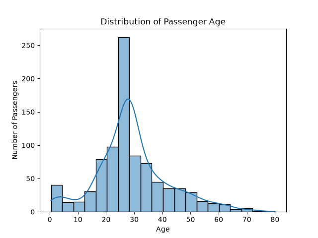
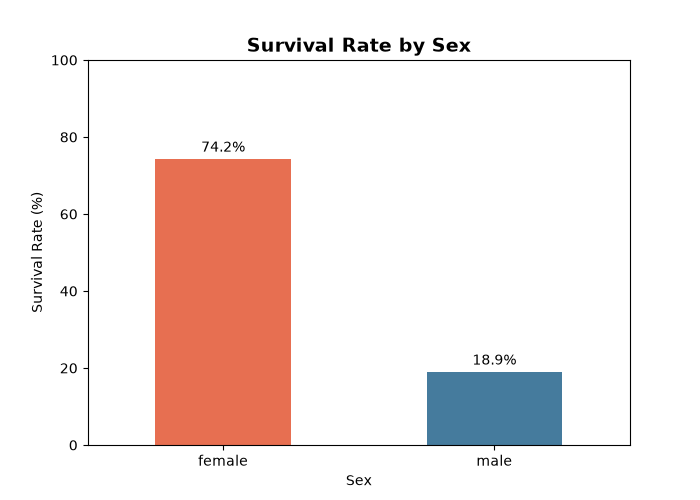
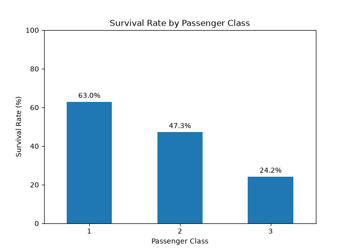

# 🚢 Titanic Passengers Survival Prediction

## 📌 Project Overview

This project analyzes the Titanic passenger dataset and develops a machine learning classification model to predict whether a passenger survived or did not survive the Titanic disaster.

The project follows a complete data analysis and machine learning workflow, including data cleaning, exploratory data analysis (EDA), visualization, feature preparation, model training, and evaluation.

## 🎯 Project Objective

The primary objective of this project is to predict passenger survival using available passenger information.

The target variable is:

- `1` = Survived
- `0` = Did Not Survive

## 📂 Dataset

The dataset contains information about 891 Titanic passengers.

The columns used include:
- PassengerId
- Survived
- Pclass
- Sex
- Age
- SibSp
- Parch
- Fare
- Embarked

## 🧹 Data Cleaning and Preparation

The following preprocessing steps were performed:

- Inspected the dataset structure and data types.
- Checked for missing values.
- Checked for duplicate records.
- Handled missing Age values using the median.
- Handled missing Embarked values using the mode.
- Removed the Cabin column because of its high proportion of missing values.
- Removed PassengerId before modeling because it is an identifier rather than a meaningful predictive feature.
- Encoded categorical variables.
- Split the dataset into training and testing sets.
- Standardized numerical features before model training.

## 🔍 Exploratory Data Analysis

The analysis examined passenger demographics, survival patterns, age, fare, passenger class, and sex.

### Key Statistics

- Total passengers: **891**
- Passengers who survived: **342**
- Passengers who did not survive: **549**
- Overall survival rate: **38.38%**
- Average age: **29.36 years**
- Average fare: **32.20**

## 📊 Key Findings

### Survival by Sex

Female passengers had a survival rate of 74.20%, compared with 18.89% for male passengers.

### Survival by Passenger Class

| Passenger Class | Survival Rate |
|---|---:|
| 1st Class | 62.96% |
| 2nd Class | 47.28% |
| 3rd Class | 24.24% |

The analysis shows a substantial association between passenger class and survival rate.

### Survival by Age

The average age of passengers who survived was 28.29 years, while passengers who did not survive had an average age of 30.03 years.

The median age for both groups was 28 years.

## 📈 Visualizations

### Age Distribution

### Survival Rate by Sex

### Survival Rate by Passenger Class

### Confusion Matrix

## 🤖 Machine Learning Model

A **Logistic Regression** model was selected because the target variable is binary:

- `0` = Did Not Survive
- `1` = Survived

The dataset was divided into training and testing datasets before model training.

## 📊 Model Evaluation

The Logistic Regression model achieved an overall accuracy of:

### **80.45%**

The confusion matrix was:
[[98 12]
 [23 46]]
 
Key Insight
The strongest pattern observed in the dataset was the substantial difference in survival rates by sex.
Female passengers had a survival rate of 74.20%, compared with only 18.89% for male passengers.
Passenger class was also strongly associated with survival, with first-class passengers having a considerably higher survival rate than third-class passengers.

🏁 Conclusion
The analysis demonstrates that passenger characteristics such as sex, passenger class, age, and fare contain useful information for predicting Titanic survival. The Logistic Regression model achieved an accuracy of 80.45%, indicating reasonably good predictive performance on the test dataset. The confusion matrix and classification metrics provide additional insight into the types of errors made by the model. These findings describe associations within the dataset and should not be interpreted as proof that any individual characteristic directly caused survival.

🛠️ Tools and Technologies
Python
Pandas
NumPy
Matplotlib
Seaborn
Scikit-learn
Jupyter Notebook
VS Code
Git & GitHub

👩‍💻 Author
Eya Chinyere Euphemia
Data Science Learner | Power Distribution Operations Professional
